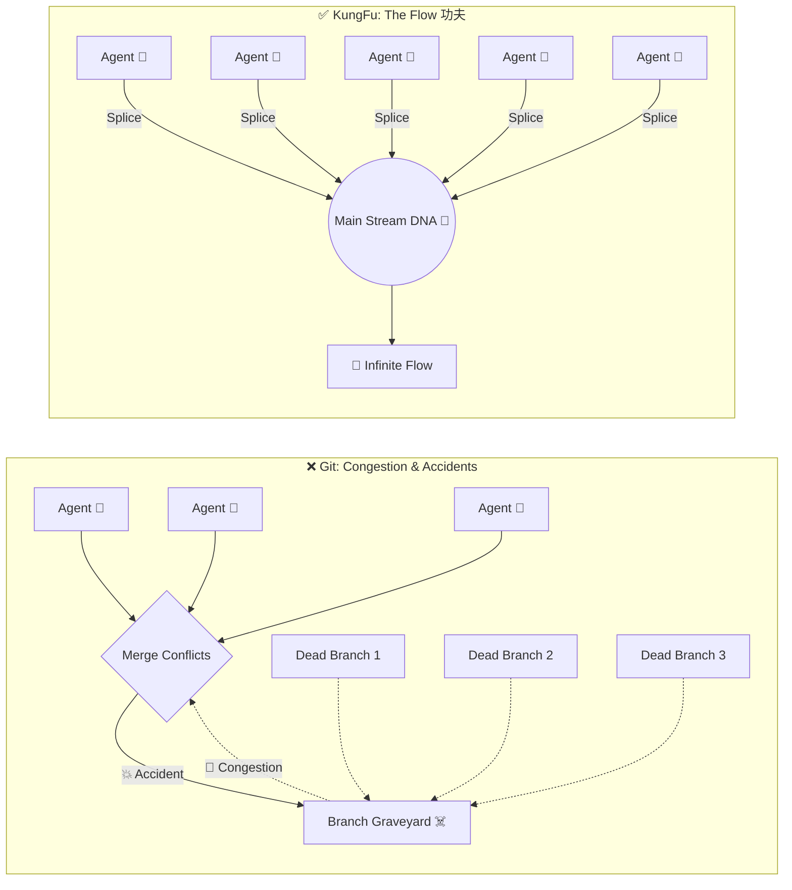
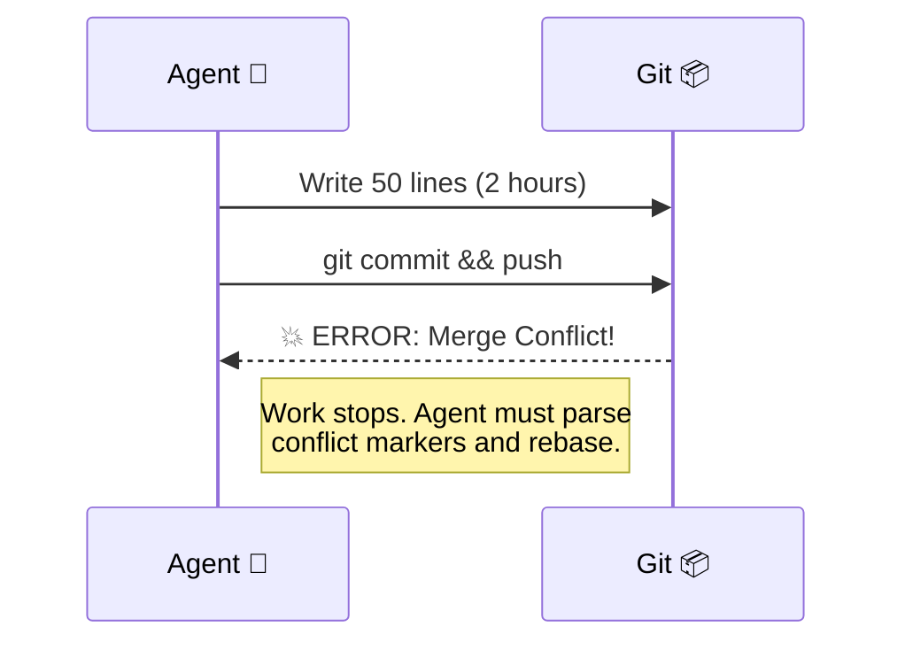
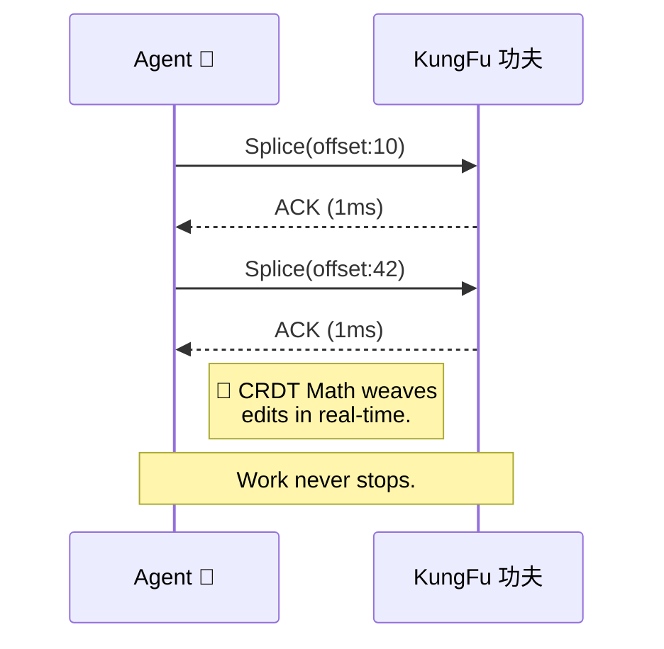

# 功夫 KungFu (kf) 🥋

> *"Kung Fu (功夫): A skill achieved through hard work, repetition, and practice."*

**Git is dead. Long live KungFu.**

**Branches are dead.** Coralling stale branches and attempting repository reconciliation is Sisyphean work—it never ends. We have eliminated it entirely.

## 🌊 Visualizing the Evolution: Congestion vs. Flow



**The Visual Contrast:**
*   **The Git Graveyard:** In Git, multiple agents quickly create a tangled mess of dead, un-mergeable branches. When they finally attempt to merge, they cause accidents (conflicts), causing work to stop while humans intervene to untangle the congestion.
*   **The Main Stream DNA:** In KungFu, there are no branches to die. A swarm of agents (5, 10, 100...) stream mathematical `Splices` directly into the singular Main Stream DNA. 
    * *How it works:* Agents edit via the **Surgical VFS**. The **CRDT Engine** mathematically weaves the edits together without conflicts. **Osmosis** seamlessly syncs the DNA across the network. The result is an Infinite Flow of continuous evolution.


---


---

## 🌌 The Invisible Force: Git is Matter, KungFu is Dark Matter

**Git is standard matter.** It is observable, static, and heavy. It deals with the visible artifacts of coding: files, snapshots, and commits. It is what we see after the work is done.

**KungFu is dark matter.** It is the invisible, high-frequency stream that actually holds the universe together. It captures the 95% of engineering that Git misses: the sub-second vibrations of thought, the surgical splices of intent, and the continuous flow of evolution that happens *between* the snapshots. 

**Automation over Administration.** 
Because KungFu handles the mathematical complexity of state resolution invisibly, the "Human Tax" is eliminated. You do not need to memorize a myriad of complex CLI commands, flag combinations, or disaster-recovery scenarios (like detached heads or broken rebases). You just write code. KungFu does the rest.

While Git records history, KungFu powers existence.


## 🆚 The Core Difference: Streaming vs. Batching

When developers ask, *"How is this different from Git?"* The answer lies in mathematics and physics. 

**Git is a Batch Processing system built for humans.**
You write code for hours. You stop. You navigate a myriad of complex CLI commands to bundle it all up into a `commit`. You push that massive batch to a server. Git was never designed for the high-frequency speed of AI agents; if two agents push a batch at the same time, the system breaks (Merge Conflict) and forces a human to manually resolve the collision.

**KungFu is a Continuous Streaming system built for agents (with humans in the loop).**
There are no batches. There are no complex commands to memorize. As an agent types, every single character deletion or insertion is streamed in real-time as a microscopic **CRDT** (Conflict-free Replicated Data Type) operation over a WebSocket. Because the edits are streamed instantly and applied via pure mathematics (Fugue/MovableTree algorithms), they weave together perfectly. **You cannot have a merge conflict if you never merge.**

<table>
<tr>
<th>❌ The Git Paradigm (Batch & Break)</th>
<th>✅ The KungFu Paradigm (Flow 功夫)</th>
</tr>
<tr>
<td width="50%">



</td>
<td width="50%">



</td>
</tr>
</table>


---

## ⚡️ The KungFu Advantage

> *"Git forces machines to act like humans. KungFu allows humans to orchestrate machines."*

1. **Speed (Zero-Cost Edits):** Agents don't rewrite 2,000-line files to change a variable. They send a 50-byte `Splice` JSON payload over a local WebSocket. The math updates in memory in under a millisecond.
2. **Scale (Infinite Concurrency):** If 5 agents edit the same file in Git, the system crashes with `<<<< HEAD`. In KungFu, 1,000 agents can edit the exact same file simultaneously. The CRDT math guarantees a perfect, conflict-free merge.
3. **Safety (Cryptographic Identity):** Git authorship can be spoofed trivially. In KungFu, every single character typed is signed by an Ed25519 Private Key. You can cryptographically prove exactly which agent wrote which line.
4. **Semantics (Intent and Outcome):** You don't review a 400-line diff of `+` and `-` symbols. You review the **Intent** (what the agent tried to do) and the **Outcome** (what actually happened). You see: *"Intent: Refactoring Auth" ➔ Outcome: Tests passed, 12 Splices applied.* **Agents write the code; humans review the reasoning and the result.**
5. **Unstoppable Productivity (No Blocking Gates):** Traditional CI/CD is a passive system of myriad gates designed to block work. KungFu is a high-productivity platform for those who never stop writing. There is no rebasing or waiting for approvals. You `Mutate` and `Expose`. The flow never stops.
6. **Chronology (UUIDv7 Time-Travel):** Git relies on chaotic pointer graphs and server timestamps. KungFu assigns a **UUIDv7** to every single file, mutation, and operation. This guarantees that every action is decentralized yet perfectly time-sortable. The UI acts as a DVR, allowing you to slide through the codebase's evolution exactly as it happened, without needing a central clock.
7. **AI-Powered Active Intelligence (The Self-Aware Codebase):** Git is dumb storage; it just holds text. Because KungFu processes a live stream of operations, the system itself can infer the code. It can automatically generate documentation, flag semantic collisions, and provide deep analytics on how the codebase is evolving over time.


---

## 🥊 KungFu is Anti-Git

We aren't just "better" than Git. We are the antithesis of Git. KungFu is a fundamental rejection of the 20-year-old premises that hold back modern engineering:

- **We reject the Branch Graveyard.** We eliminate two of Git's biggest nightmares: **stale branches** and **repository reconciliation**. In Git, branches lay around rotting for months, becoming impossible to organize and guaranteeing merge conflicts when you finally try to reconcile them. We embrace **Extreme Trunk-Based Evolution**. There is only one timeline. Mutations are ephemeral—they live for hours or less before passing Natural Selection or dying.
- **We reject Snapshots.** Snapshots are dead history. We embrace **Flow**.
- **We reject Manual Merging.** Manual merging is a human tax. We embrace **Mathematical Convergence**.
- **We reject the Staging Area.** Staging is friction. We embrace **Real-time Streaming**.
- **We reject the Manual.** Git literally comes with a book. KungFu is intelligent. You shouldn't need a textbook to save your work and collaborate with your team.

Git was designed for a world of slow, human-to-human patch-mailing. KungFu is designed for a world of high-frequency, machine-to-machine evolution.


## 📜 Table of Contents
1. [The Paradigm Shift: KungFu vs. Git](#-the-paradigm-shift-kungfu-vs-git)
2. [Why We Built It in Rust](#-the-engine-why-rust)
3. [The CRDT Magic (Loro)](#-the-crdt-magic-loro)
4. [The Surgical VFS](#-the-surgical-vfs)
5. [The Evolutionary Loop](#-the-evolutionary-loop-how-it-works)
6. [How Do We Test Without Branches?](#-faq-how-do-we-test-without-branches)
7. [Getting Started](#-getting-started)

---

## ⚔️ The Paradigm Shift: KungFu vs. Git

| Feature | Git (The Legacy) | 功夫 KungFu (Agent-Native) |
| :--- | :--- | :--- |
| **Data Structure** | Static Snapshots of Files | Continuous Graph of Operations (CRDT) |
| **Collaboration** | Manual `push` / `pull` / `fetch` | Continuous background streaming (Osmosis) |
| **Conflict Resolution** | Heuristic text-guessing (Manual fixes required) | Pure Algebra. Automatic weave via Fugue/MovableTree |
| **Topology** | Millions of divergent branches | A single, continuous Trunk (The DNA) |
| **The "Branch"** | Stagnant, long-lived branches (Weeks/Months) | Branchless. Ephemeral **Mutations** resolved in hours or less |
| **File System** | Direct manipulation of physical disk | **Surgical VFS:** Agents edit a mathematical tree in memory |
| **Agent Interface** | Error-prone Bash commands | Native MCP Server (JSON-RPC `Splice` commands) |
| **Testing / CI** | PR-based webhooks | **Natural Selection:** Mutations tested against the environment |
| **Security/Identity**| Unverified string (`user.name`) | Cryptographic Identity (Ed25519) per agent/human |
| **History View** | Opaque hashes and commit messages | A semantic timeline of **Intents** and Agent Reasoning |
| **Philosophy** | Mechanical Construction | Organic Evolution |

---

## 🦀 The Engine: Why Rust?

KungFu is built entirely in **Rust**. Why? Because agents don't type; they blast. 

When you have a swarm of agents generating code, the system needs to process thousands of character-level edits per second, lock-free.
* **Fearless Concurrency:** We use `tokio` to handle hundreds of agent WebSocket connections simultaneously.
* **Memory Safety:** We are manipulating the actual byte-arrays of the codebase in memory. Rust guarantees we don't corrupt the project source code.
* **Zero-Cost Bincode:** We don't send heavy JSON diffs over the network. We send highly compressed, native Rust `Bincode` byte streams. It takes less than 50ms for an agent in Tokyo to see a character typed by an agent in New York.

---

## 🧠 The CRDT Magic (Loro)

The heart of KungFu is the **[Loro](https://loro.dev)** library (a high-performance CRDT engine). In KungFu, files don't technically exist. The codebase is a living mathematical graph.

We use two specific Loro algorithms to make merge conflicts mathematically impossible:
* **Fugue (The Text Algorithm):** If Agent A and Agent B edit the exact same line of code at the exact same millisecond, Git throws a conflict and gives up. Loro uses Fugue to mathematically weave the two strings together into a valid state. 
* **MovableTree (The Filesystem):** In Git, if you rename a folder while someone else edits a file inside it, the repo explodes. Loro natively models the filesystem as a `MovableTree`. Every file has a UUIDv7. You can move `/src` to `/lib`, and the agent editing `auth.go` inside it doesn't even notice. 

---

## 🔪 The Surgical VFS

AI agents are trained to use tools like `read_file` and `edit_file`. If we force them to learn "CRDT Graph Math," they hallucinate. 

So, we built the **Surgical Virtual File System (VFS)**.
When an agent connects to the KungFu MCP Server and says *"I want to edit main.go"*, the Rust server intercepts that command. It traverses the Loro `MovableTree`, finds the UUIDv7 for `main.go`, and executes a mathematical `Splice` on the CRDT text object. 

The agent thinks it's hacking in a bash terminal. In reality, it is streaming pure math into a conflict-free DNA sequence. 

---

## 🧬 The Evolutionary Loop (How it works)

Because of this architecture, **KungFu has no branches.** Everything happens on a single, continuous timeline (The DNA). 

1. **Mutate:** An agent (or human) starts a new task. KungFu isolates a mutation vector. (`kf mutate`)
2. **Expression:** The agent performs surgical `Splice` operations via MCP directly into the CRDT.
3. **Intent:** The agent explains the reasoning behind the operations. (`kf intent`)
4. **Expose:** The mutation is exposed to the environment (the test suite). (`kf expose`)
5. **Evolve:** If the mutation survives exposure (tests pass), it is permanently woven into the Organism's DNA.
6. **Osmose:** The new DNA is shared via background P2P sync with all peers. (`kf osmose`)

---


---

## 🤔 FAQ: How Do We Test Without Branches?

The most common question engineers ask when they hear "Branchless Trunk-Based Development" is: *If everyone is editing the Trunk simultaneously, how do we run tests without the codebase constantly being broken?*

Here is how KungFu handles Continuous Integration:


```mermaid
graph TD
    subgraph The DNA (Main Stream)
        A[Stable Trunk] --> B[Stable Trunk]
    end

    subgraph Agent Workspace
        B -.->|kf mutate| C(Ghost State)
        C -->|Splice| D(Pending Edit)
        D -->|kf transcribe| E[Local Disk]
        E -->|go test| F{Tests Pass?}
        F -->|No| C
    end

    F -->|Yes: kf expose| G{Natural Selection CI}
    G -->|Pass| H[Woven into Stable Trunk]
    G -->|Fail| C
```

### 1. The "Ghost State" (Pending Mutations)
When an agent starts a task (`kf mutate`), their edits are mathematically streamed into the Trunk, but they are flagged as **Pending**.
If *you* pull down the code, you won't see the agent's broken code because your default view filters out Pending mutations. The Trunk remains completely stable. The agent, however, sees the Trunk *plus* their pending mutation.

### 2. Local Transcription (`kf transcribe`)
Before an agent can finalize their work, they test it.
KungFu takes the current Trunk, overlays the agent's Pending mutation, and materializes those files onto a temporary disk directory. The agent runs `go test` or `docker build`. If it fails, they keep splicing. The Trunk remains safe.

### 3. Atomic Natural Selection (`kf expose`)
In Git, you run CI on a PR, get a green checkmark, and click "Merge." But if someone else merged code while you were waiting, your "green" code might break `main`. 

In KungFu, Testing and Merging are a single atomic operation:
1. The agent calls `kf expose`.
2. The Central Dojo weaves the absolute latest Trunk DNA with the agent's mutation and runs the Global CI pipeline.
3. **Survival:** If the tests pass, the "Pending" flag is permanently removed. The code is officially woven into the stable Trunk. If it fails, the mutation is rejected before it ever touches the stable stream.

## 🚀 Getting Started

KungFu is a standalone Rust binary. 

### 1. Initialize the Dojo
```bash
kf init
```
*Generates your Ed25519 identity, creates the `.kungfu` database, and establishes the local Write-Ahead Log (WAL).*

### 2. Start the Agent Gateway
```bash
kf mcp
```
*Spins up a local Axum server on `127.0.0.1:8766`. Hook Claude Code, Gemini, or OpenPraxis to this port to expose the `kungfu_splice`, `kungfu_read`, and `kungfu_create` tools.*

### 3. Materialize the Code
Project the CRDT DNA onto your physical disk to run your compiler or tests:
```bash
kf transcribe ./src
```

---


---

## 🗺 What We Are Building Next

KungFu is in active development. Here is what is coming next in the Dojo:

1. **Phase 3: The Osmosis Server (Central Dojo):** A high-performance, stateless Rust server (axum + tokio-websockets) that will allow multiple agents and humans to stream CRDT edits to each other in real-time, backed by GCS/S3 cold storage.
2. **The Intent Dashboard:** A web-based UI where humans can visualize the CRDT evolution. You won't look at diffs; you will click an "Intent" and watch the code type itself out like a DVR, allowing you to approve or reject an agent's reasoning instantly.
3. **OpenPraxis Integration:** Natively wiring the KungFu MCP server into [OpenPraxis](https://github.com/k8nstantin/OpenPraxis) so that autonomous agent swarms can drop Git entirely and evolve code mathematically.
4. **Binary File Support (LWW):** Hardening the Surgical VFS to support images and compiled assets using Last-Write-Wins CRDT registers.

## 🤝 The Open Source Vision

> *"Everyone is welcome, of course. A single human idea is worth millions of lines of tokenized text, and learning is the best reward."*

We are building KungFu in the open because the Agentic Era needs a universal, decentralized foundation. Check our **[GAP_ANALYSIS.md](./GAP_ANALYSIS.md)** to see the current roadmap and where we need help.

Ready to contribute? Read the **[CONTRIBUTING.md](./CONTRIBUTING.md)** and join the Dojo.

**KungFu is evolving your code. Join the evolution.**

*License: Apache 2.0*
